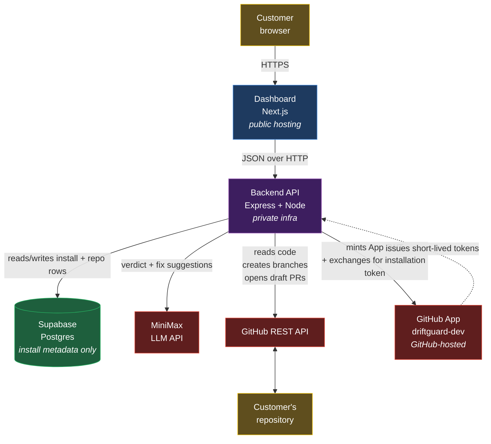
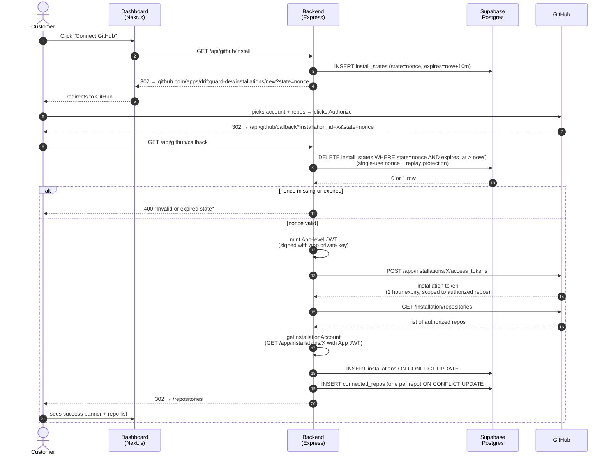
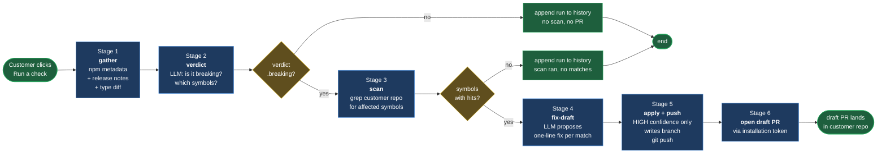
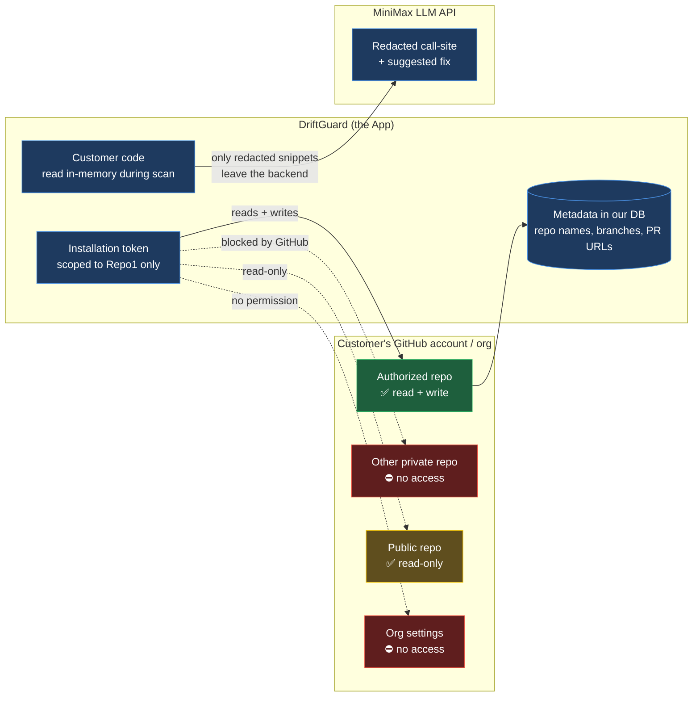
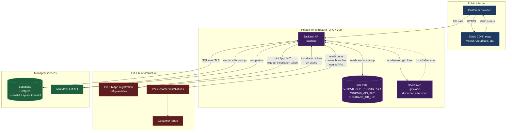

# DriftGuard — Mermaid diagrams

Three diagrams covering the full architecture. Paste any block into a
Mermaid renderer (GitHub markdown, mermaid.live, Notion, Obsidian, etc.).

---

## 1. System overview

Where each piece lives and what data flows between them.

---

## 2. Install flow (sequence)

What happens between "Customer clicks Connect GitHub" and "Customer sees
their repo in the dashboard."

---

## 3. Check pipeline (flow)

The 6-stage engine that runs when a customer clicks **Run a check**.

---

## 4. Trust boundary diagram

What DriftGuard has access to vs. what it doesn't. Useful for security
review conversations.

---

## 5. Hosting model

What runs where, and what state lives where.

